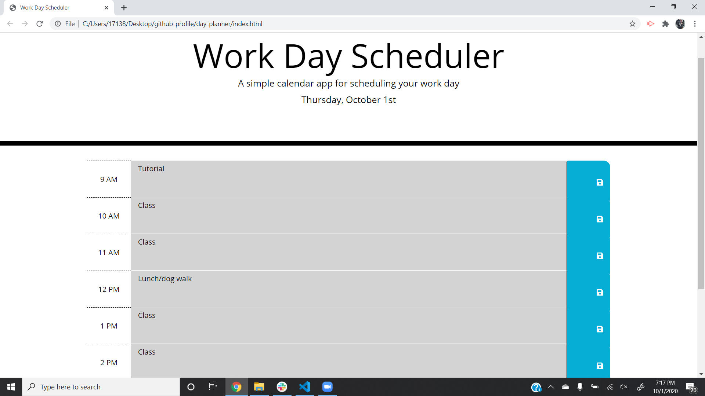

# day-planner

Time management is a vital tool for everyone from students to executives.  It is not only important to know what is coming up, but also what has already passed.  To that end, I have built a day planner for the average business day (9-5), that incorporates a number of useful featers.

## Features of the day planner
* Text entered and saved in the text box is saved into local storage so the user can navigate away from the page and retain their schedule
* Color coding separates hours in the future (green) from the current hour (red) and previous hours (grey)
* Dynamic date generator at the top always displays the current date

# View the day planner [here](https://ikethe4.github.io/day-planner/)

By utilizing tools like the day planner shown here, the user can increase productivity by making sure their time is properly managed.